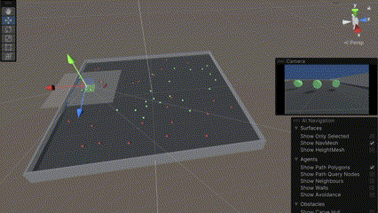

# ml-agents-banana-collector
Collect good food and avoid bad food using Deep Q-Networks with Gym and Unity ML-Agents Toolkit



This repository solves the [Banana Collector project](https://github.com/udacity/deep-reinforcement-learning/tree/561eec3ae8678a23a4557f1a15414a9b076fdfff/p1_navigation) from the Udacity "Deep Reinforcement Learning" Nanodegree. However, there are no bananas...

## Background
The [introduction video from Udacity about how DeepMind leveraged a Deep Q-Network (DQN) to build the Deep Q-Learning algorithm that learned to play many Atari video games better than humans](https://youtu.be/GgtR_d1OB-M) explains in brief the algorithms and concepts applied in this project.
The naive Q-learning algorithm is enhanced by a replay buffer and uses [Experience Replay](https://www.youtube.com/watch?v=wX_-SZG-YMQ) to sample from the buffer at random.
Additionally, two separate networks with identical architectures are used and the "target" Q-Networks's weights are updated less often than the "primary" Q-Network.
This concept decouples the updating of the networks weights from the agent's actions, providing a more stable learning environment as explained in [this video](https://www.youtube.com/watch?v=SWpyiEezfp4).
More details are provided in the paper "[Human-level control through deep reinforcement learning](https://storage.googleapis.com/deepmind-media/dqn/DQNNaturePaper.pdf)" from Google DeepMind.

## Extending the challenge
The pre-built Banana Collector environments as described in the [project instructions](https://github.com/udacity/deep-reinforcement-learning/tree/561eec3ae8678a23a4557f1a15414a9b076fdfff/p1_navigation) is not used for solving the challenge. 
Instead, [ML-Agent's Food Collector learning environment](https://github.com/Unity-Technologies/ml-agents/blob/7a03145ae48ad354821bd89e0243d99332149ace/docs/Learning-Environment-Examples.md#food-collector) is adapted to mimic the behavior of the Banana Collector.
So Udacity's great lectures and the example will remain useful even though ML-Agents, Unity and Torch evolve.
Furthermore, understanding end to end the DQN's theory and how Unity and ML-Agents work certainly provide an inspiring experience.

## Summary of the solution
This repository contains the complete source code for the environment and the training of the agent enabling the reproduction of the presented results and further evolution.
The Unity ML-Agents's environment contains three sensors, but only one at a time is used for training and inference.
- [Ray Perception Sensor 3D](https://www.immersivelimit.com/tutorials/rayperceptionsensorcomponent-tutorial) with 6 Rays Per Direction and 3 Stacked Raycasts.
- [Camera Sensor](https://www.youtube.com/watch?v=7FHyqzUBzZ0), mounted at the agent (64x64 RGB).
- Grid Sensor (used for observing the training progress only).

The **complete code and the detailed results are provided in the [notebook (Navigation.ipynb)](/../../blob/main/Navigation.ipynb) and the report at github-pages**.

## Ideas for further improvements
- Stacking a few image frames may enable the (convolution) layers to extract some temporal properties across those frames. This is currently done with the Ray Perception Sensor. It has 3 stacked observations per [Decision Period (4)](https://docs.unity3d.com/Packages/com.unity.ml-agents@1.0/api/Unity.MLAgents.DecisionRequester.html).
- The agent has an inertia. So accelerating and braking are not immediate and take time. Turning while moving results in the agent drifting through the curves. A human player learns to adapt to this behavior after a while. Hence, using the speed vector of the agent as an additional feature (x,y) will likely enable the agent to learn moving more efficiently and smoothly. It is already available in the observations space of the Ray Perception Sensor. The idea of fusion of image data and other sensor data is demonstrated in the paper [Learning Selective Sensor Fusion for States Estimation](https://arxiv.org/pdf/1912.13077.pdf). A [RNN](https://www.youtube.com/watch?v=H3ciJF2eCJI)/LSTM([1](https://www.youtube.com/watch?v=V3D5ovKE9Og),[2](https://www.youtube.com/watch?v=XHEsLfquXtg)) is used there for further processing.
- In the same [paper](https://arxiv.org/pdf/1912.13077.pdf), a [FlowNet-style architecture](https://github.com/changhao-chen/selective_sensor_fusion/blob/master/models.py) is used as feature encoder. Flownet provides features that are suited for optical flow prediction, which highly contributes to the egomotion detection. For a global re-localization task, they use Residual Neural Network (ResNet) to extract features from a set of single images. This is likely for very advanced students.
- Deep Q-Learning tends to overestimate action values. [Double Q-Learning](https://arxiv.org/abs/1509.06461) has been shown to work well in practice to help with this. (Proposed by Udacity).
- Deep Q-Learning samples experience transitions uniformly from a replay memory. [Prioritized experienced replay](https://arxiv.org/abs/1511.05952) is based on the idea that the agent can learn more effectively from some transitions than from others, and the more important transitions should be sampled with higher probability. (Proposed by Udacity).
- Currently, in order to determine which states are (or are not) valuable, we have to estimate the corresponding action values for *each action*. However, by replacing the traditional Deep Q-Network (DQN) architecture with a [dueling architecture](https://arxiv.org/abs/1511.06581), we can assess the value of each state, without having to learn the effect of each action. (Proposed by Udacity).

All these ideas may be applied individually or combined all together.

I am happy to merge pull requests to extend this solution!


## Installation and setting up the environment
Clone the current repository using
```
git clone https://github.com/joewa/ml-agents-banana-collector.git
```
Following [ML-Agents installation instructions](https://github.com/Unity-Technologies/ml-agents/blob/main/docs/Installation.md) is recommended to get an up-to-date environment. How to integrate ML-Agents is described here too.

Of course, replicating the current environment at the time of writing is possible using
```
git clone https://github.com/Unity-Technologies/ml-agents.git
conda create -n banana python=3.10 ffmpeg
cd ml-agents
pip install ./ml-agents-envs
pip install ./ml-agents
pip install jupyterlab matplotlib opencv-python-headless
```
In case of a `TypeError: 'numpy._DTypeMeta' object is not subscriptable` when running the imports in `Navigation.ipynb`, please try:
```
pip install numpy --upgrade
```

## Building the report
The report is build with [jupyter{book}](https://jupyterbook.org/). See [`make_book.py`](make_book.py) for more details.
